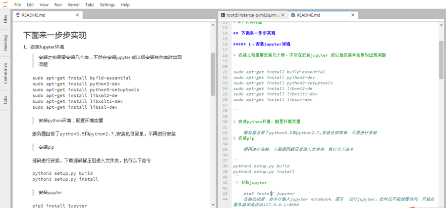
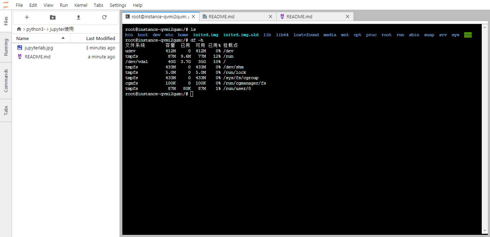

# 学习jupyter notebook的使用，使用ubuntu 16.04来一步步搭建jupyter notebook的环境

## 实现了以下几个功能：

> 1、远程登录使用jupyter notebook进行编辑

> 2、jupyter服务后台运行

> 3、服务日志信息存储到文件中

> 4、代码补全

## 下面来一步步实现

##### 1、安装Jupyter环境     

> 安装之前需要安装几个库，不然在安装jupyter 或以后安装其他库时出现问题

```
sudo apt-get install build-essential
sudo apt-get install python3-dev
sudo apt-get install python3-setuptools
sudo apt-get install libxml2-de
sudo apt-get install libxslt1-dev
sudo apt-get install libssl-dev

```

> 安装python环境，配置环境变量
    
    服务器自带了python3.5和python2.7,安装也很简单，不再进行安装
> 安装pip
    
    源码进行安装，下载源码解压后进入文件夹，执行以下命令
    
```
python3 setup.py build  
python3 setup.py install
```
 > 安装jupyter
 
    pip3 install jupyter
    安装成功后，命令行输入jupyter notebook，回车  运行jupyter。此时还不能远程访问，只能在服务器本地访问127.0.0.1:8000

##### 2、远程访问设置

> 生成配置文件

```
执行  jupyter notebook --generate-config  生成配置文件~/.jupyter/jupyter_notebook_config.py
```
> 设置登录密码

```
输入python3回车，打开python交互命令行模式
from notebook.auth import passwd
passwd()
输入以上两个语句，输入两遍密码，将加密后的密码复制,后面需要使用
```
> 设置配置文件 

``` 
vim ~/.jupyter/jupyter_notebook_config.py
添加以下语句
c.NotebookApp.ip='*' # 设置所有ip皆可访问
c.NotebookApp.password = u'sha:ce... # 刚才复制的那个密文'
c.NotebookApp.open_browser = False # 禁止自动打开浏览器，因为要远程访问，所以不需要打开服务器浏览器
c.NotebookApp.port =8888  #配置端口
c.NotebookApp.allow_root =True  #设置允许以root远程访问
c.NotebookApp.notebook_dir = '/home/jupyWorkspace/'  #配置工作目录

```     
> 远程访问

```
启动jupyter，  命令行输入jupyter notebook
浏览器打开  服务器IP:8888,输入密码即可进行远程访问
现在jupyter可以远程访问，但是还有问题就是当SSH登录窗口关闭时，jupyter也不能访问
```

##### 3、配置服务后台运行

> 后台执行的shell命令

```
nohup jupyter notebook >log.txt 2>&1 &    
这个命令可以使jupyter在后台运行，并将服务器运行日志保存到log.txt中
但是每次启动服务就要执行这条语句不太方便，可以使用shell脚本文件来执行这条语句
vim start.sh
输入一下代码，并保存
#! /bin/bash
nohup jupyter notebook >log.txt 2>&1 &
chmod +x start.sh   #赋予start.sh执行权限
执行bash start.sh 就可以在后台运行了，即使SSH窗口关闭也能够访问
以上也能够实现功能，但是想要重启jupyter时会有问题，
如果jupyter已经启动，再启动jupyter时端口号会逐次往上加，多个服务器启动，造成端口比较混乱
可以改成先结束进程然后再启动
#! /bin/bash
killall -9 jupyter-notebook
nohup jupyter notebook >log.txt 2>&1 &
先杀死jupyter notebook，再重新启动，这样就会只有一个8888端口在运行
这样每次想要重启jupyter时只需要运行start.sh即可
```
##### 4、代码补全
```
使用jupyter无法代码补全确实不太方便，下面就配置代码补全
还是需要修改配置文件
vim ~/.jupyter/jupyter_notebook_config.py   #打开配置文件，在之前基础上添加以下代码
c.Completer.greedy = True
c.Completer.jedi_compute_type_timeout = 400
c.Completer.use_jedi = True
这样就可以使用tab进行代码提示和补全了

```
##### 5、Jupyter lab的使用
```
接触jupyterlab后发现，真的很强大，界面和功能和IDE不相上下，支持R和C语言，支持多窗口并列查看，还支持终端和python交互界面，在编写markdown时可以边编写边预览等等功能
在安装完jupyter后，只需要安装jupyterlab就行了
pip3 install jupyterlab
执行jupyter lab就运行起来了
浏览器访问 ip:8888/lab就可以访问了
```
### 下面分享一下我的jupyterlab使用界面

- markdown预览



- 系统终端


